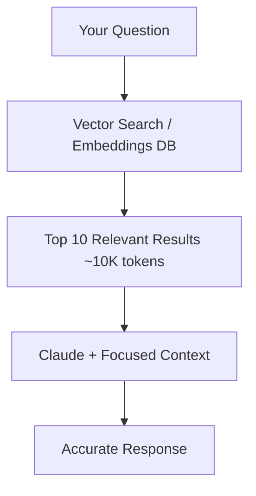

# Mastering Context Management in Claude: Your Brain's New Power Tool

## Introduction: The Neural Network Meets Your Network of Neurons

Imagine your brain processing a complex coding problem. You don't re-read every programming book you've ever studied—instead, you recall relevant patterns, keep active context in your working memory, and reference documentation when needed. Large Language Models (LLMs) like Claude work remarkably similarly, but with one critical difference: their "working memory" is fixed at 200,000 tokens.

**What is an LLM?** At its core, a Large Language Model is a sophisticated pattern recognition system trained on vast amounts of text data. Think of it as a brilliant collaborator who has processed millions of books, articles, and code repositories, and can generate responses based on those patterns—but unlike your brain, it cannot truly "think" or form new abstract concepts beyond its training.

---

## The Honest Truth: What LLMs Can't Do

Just as knowing your brain's limitations makes you a better learner, understanding what LLMs **cannot** do is crucial for effective collaboration:

### Core Limitations

1. **Probabilistic, Not Deterministic** - LLMs predict statistically likely next tokens based on patterns; they don't execute formal logic or proofs
2. **No Real-Time Learning** - They can't update their knowledge base during conversation; everything is pattern matching from training data
3. **No True Memory** - Unlike your brain's hippocampus, LLMs don't form lasting memories; each conversation starts fresh
4. **No Verification Capability** - They can't independently verify if generated code actually runs correctly without tools
5. **No Browsing Ability** (without tools) - Can't access real-time information or external resources independently
6. **No Mathematical Certainty** - May confidently give wrong calculations despite appearing certain
7. **Context Window Constraints** - Once you exceed ~200K tokens, earlier information literally "falls out" of memory
8. **No Persistent State** - Can't remember previous conversations unless explicitly provided
9. **No Causal Understanding** - Understands correlation from training data, not causation

> **The Brain Analogy**: Your brain's working memory can hold 7±2 items; Claude's is ~200K tokens. But your brain can store limitless long-term memories and create new neural pathways. Claude cannot.

> **Note on Reasoning**: Claude 4.x models with extended thinking have significantly improved multi-step reasoning. For complex analytical tasks, enabling extended thinking (reasoning tokens) can yield much more reliable results—see the Extended Thinking section below.

---

## What LLMs Excel At: Playing to Their Strengths

### The LLM Superpower Suite

1. **Pattern Recognition at Scale** - Instantly recall patterns from millions of code examples
2. **Code Generation & Completion** - Generate boilerplate, implement known patterns, and suggest completions
3. **Refactoring & Translation** - Transform code between languages or architectural patterns
4. **Documentation & Explanation** - Articulate complex concepts in multiple ways
5. **Summarization** - Distill large amounts of information into concise summaries
6. **Consistency** - Apply coding standards uniformly across large codebases
7. **Rapid Prototyping** - Quickly generate MVP implementations
8. **Multi-Language Proficiency** - Work across dozens of programming languages simultaneously
9. **24/7 Availability** - Never tired, always ready to assist
10. **Objective Code Reviews** - Analysis without ego or office politics

> **Use LLMs for what they're best at**: generating from patterns, summarizing, and maintaining consistency. Use your brain for what it's best at: strategic thinking, creative problem-solving, and final verification.

---

## Context Windows Across Leading Models

| Model | Context Window | Best Use Case |
|-------|---------------|---------------|
| **Claude Opus 4.7** | 200K tokens | Most complex reasoning, nuanced architecture decisions |
| **Claude Sonnet 4.6** | 200K tokens | Balanced performance, everyday coding tasks |
| **Claude Haiku 4.5** | 200K tokens | Fast, lightweight tasks, high-volume automation |
| **GPT-4o** | 128K tokens | General purpose, multimodal tasks |
| **Gemini 1.5 Pro** | 1M+ tokens | Processing extremely large documents/codebases |

### Token Size Reference
- **1 token** ≈ 4 characters in English
- **200K tokens** ≈ 150,000 words ≈ 500 pages of text
- **Average code file** = 500–2,000 tokens
- **Medium React component** = 300–800 tokens

### Choosing the Right Model

| Task | Recommended Model |
|------|------------------|
| Quick bug fix, boilerplate | Haiku 4.5 |
| Feature development, refactoring | Sonnet 4.6 |
| Complex architecture, extended thinking | Opus 4.7 |
| High-volume batch processing | Haiku 4.5 |

---

## The Art of Context Window Management

### The Golden Rule: Your Context is Your Brain's RAM

Think of your 200K token context window like your computer's RAM during development:
- **Keep it clean** - Remove unused context and stale information
- **Keep it organized** - Structure matters for quick reference
- **Keep it relevant** - Don't load everything at once
- **Keep it updated** - Remove outdated context before adding new

---

## Essential Context Management Strategies

### 1. **Markdown Files (.md)** - Your Documentation Layer

Markdown files serve as your **persistent knowledge base**—like your brain's long-term memory.

**Why Markdown?**
- **Human-Readable**: Easy for both you and Claude to parse
- **Version Controllable**: Track changes with git
- **Searchable**: Grep-friendly for quick lookup
- **Structured**: Headers, lists, tables organize information
- **Universal**: Works across all tools and platforms

**Best Practices:**
- Create project `README.md` with architecture overview
- Maintain `CONVENTIONS.md` for coding standards
- Use `DECISIONS.md` for architectural decision records (ADRs)
- Keep `TROUBLESHOOTING.md` for common issues

**Example Structure:**
```
project/
├── CLAUDE.md              # Claude Code working memory (see below)
├── README.md              # High-level overview
├── docs/
│   ├── ARCHITECTURE.md    # System design
│   ├── API.md             # API documentation
│   └── SETUP.md           # Development setup
└── .claude/
    └── skills/            # Reusable procedures
```

> **Brain Analogy**: Markdown files are like your notebooks—you don't carry all notebooks everywhere, but you know exactly where to find information when needed.

---

### 2. **CLAUDE.md** - Your Working Memory Document

`CLAUDE.md` (uppercase, at your project root) is the **primary working memory file** Claude Code reads automatically at the start of every session. It acts as your persistent briefing document.

**Ready-to-use CLAUDE.md template:**

```markdown
# Project: MyApp

## Tech Stack
- Backend: FastAPI + SQLAlchemy + PostgreSQL
- Frontend: React + TypeScript + Vite
- Auth: JWT + OAuth2

## Conventions
- Use async/await for all DB operations
- Follow PEP 8 for Python
- Use functional components in React
- All API responses use snake_case

## Common Commands
- Start dev: `npm run dev`
- Run tests: `pytest -v`
- Migrate DB: `alembic upgrade head`
- Lint: `ruff check .`

## Current Sprint Goals
- [ ] Implement user authentication
- [ ] Add password reset flow
- [ ] Write unit tests for auth service

## Active Context
- Working on: backend/auth/service.py
- Last change: Added JWT token generation
- Next task: Implement refresh token logic

## Important Notes
- Never commit .env files
- All DB migrations require team review before merge
- Staging deploys automatically on merge to `develop`
```

**Key points:**
- Place at **project root** — Claude Code reads it automatically
- Also supported: `~/.claude/CLAUDE.md` for global preferences across all projects
- Update after each major task completion

---

### 3. **Skills** - Your Procedural Memory

Skills are **procedural knowledge**—how to do specific tasks, like deploying code or running a release.

**Location**: `.claude/skills/[skill-name]/SKILL.md`

**Structure:**
```markdown
---
name: deploy-to-production
description: Step-by-step deployment process
---

# Production Deployment Skill

## Prerequisites
- [ ] All tests passing
- [ ] Code reviewed and approved
- [ ] Staging validation complete

## Steps
1. Create release branch: `git checkout -b release/v1.x.x`
2. Update version in `package.json`
3. Run build: `npm run build`
4. Deploy to staging: `./scripts/deploy-staging.sh`
5. Run smoke tests
6. Deploy to production: `./scripts/deploy-prod.sh`
7. Monitor logs for 15 minutes
8. Tag release: `git tag v1.x.x`

## Rollback Procedure
If issues detected:
1. `./scripts/rollback.sh [previous-version]`
2. Notify team via Slack
3. Create incident report
```

**Why Skills Matter:**
- **Consistency**: Same process every time
- **Onboarding**: New team members learn procedures quickly
- **Context Saving**: Claude references the skill instead of you re-explaining
- **Version Control**: Track procedure changes over time

> **Brain Analogy**: Skills are like muscle memory—you document procedures once, then execute them automatically without cluttering your working memory.

---

### 4. **Tools** - Your Extended Capabilities

Tools extend Claude's abilities beyond text generation. In Claude Code, these are the actual built-in tools:

| Tool | Purpose | Example Use |
|------|---------|-------------|
| **Read** | Read file contents | Read a source file before editing |
| **Edit** | Make precise string replacements | Fix a specific bug in a file |
| **Write** | Create or overwrite files | Create a new component file |
| **Bash** | Run shell commands | Run tests, git operations |
| **Grep** | Search file contents with regex | Find all usages of a function |
| **Glob** | Find files by pattern | List all `*.test.ts` files |
| **WebFetch** | Fetch a URL | Read API documentation |
| **WebSearch** | Search the web | Look up library docs |

**Smart Tool Usage Pattern:**

```
## Task: Debug failing API endpoint

1. Understand  → Grep for error, Read the endpoint file
2. Analyze     → Bash to run tests and reproduce error
3. Fix         → Edit to apply the fix
4. Verify      → Bash to run tests again, confirm passing
```

**Golden Rule**: Use tools to gather current state, then let Claude's pattern recognition do the heavy lifting.

---

### 5. **MCP Servers** - Your External Integrations

Model Context Protocol (MCP) servers are **specialized integrations**—they connect Claude to external systems and data sources on demand.

**Common MCP Servers:**

- **Database MCP**: Query schema, run SQL, analyze query performance
- **GitHub MCP**: Create issues/PRs, search repos, read commit history
- **Slack MCP**: Send messages, read channel history, create notifications
- **Google Drive MCP**: Read/write documents, search files
- **Custom Domain MCP**: Company APIs, internal tools, legacy systems

**When to Use MCP:**
- Need real-time external data
- Integrate with proprietary systems
- Automate multi-step workflows
- Access specialized knowledge bases

**Context Management Benefit**: Instead of copying entire database schemas into context, MCP servers provide on-demand access—only fetching what's needed, when it's needed.

> **Brain Analogy**: MCP servers are like experts on your speed dial—you don't memorize everything they know; you call them when needed.

---

### 6. **Prompt Caching** - Reuse Expensive Context

Prompt caching lets you cache large, static context blocks so they aren't re-processed on every request. This dramatically reduces cost and latency when you repeatedly work with the same large context.

**How it works:**
1. Mark stable context (system prompt, large files, documentation) as cacheable
2. On the first request, Claude processes and caches the block (5-minute TTL by default)
3. Subsequent requests within the TTL reuse the cached block — only the new parts are processed

**When to use caching:**

| Scenario | Cache? | Why |
|----------|--------|-----|
| System prompt + conventions | Yes | Sent with every message, rarely changes |
| Large codebase loaded for analysis | Yes | Same files referenced repeatedly |
| Per-message user input | No | Changes every time |
| Tool call results | Situational | Only if reused across multiple turns |

**Practical example:**
```python
# Cache your project conventions + large codebase context
messages = [
    {
        "role": "user",
        "content": [
            {
                "type": "text",
                "text": large_codebase_context,
                "cache_control": {"type": "ephemeral"}  # Mark as cacheable
            },
            {
                "type": "text",
                "text": "Now fix the bug in auth/service.py"
            }
        ]
    }
]
```

**Cost impact**: Cached tokens cost ~10% of normal input token price. For a 100K-token context reused 10 times, this is a ~9x cost reduction on that context.

---

### 7. **Hooks** - Automated Workflows

Hooks let you run shell commands automatically in response to Claude Code events — without relying on Claude to remember to do it.

**Supported hook events:**

| Hook | When it fires |
|------|--------------|
| `PreToolUse` | Before Claude calls any tool |
| `PostToolUse` | After a tool call completes |
| `Stop` | When Claude finishes a response |
| `Notification` | When Claude sends a notification |

**Configuration** (in `.claude/settings.json`):
```json
{
  "hooks": {
    "PostToolUse": [
      {
        "matcher": "Edit",
        "hooks": [
          {
            "type": "command",
            "command": "npm run lint --fix"
          }
        ]
      }
    ],
    "Stop": [
      {
        "hooks": [
          {
            "type": "command",
            "command": "notify-send 'Claude finished'"
          }
        ]
      }
    ]
  }
}
```

**Practical hook uses:**
- Auto-lint/format after every file edit
- Run tests after code changes
- Send a desktop notification when Claude finishes a long task
- Log all tool calls for auditing
- Block dangerous commands (e.g., `rm -rf`) via `PreToolUse`

> **Key distinction**: Hooks execute shell commands — they are reliable automation, not "memory." If you want something to happen automatically every time, use a hook, not a CLAUDE.md note.

---

### 8. **Extended Thinking** - Deep Reasoning Mode

Extended thinking gives Claude dedicated reasoning tokens before producing a final answer. This is especially valuable for complex problems where a chain-of-thought matters.

**When to enable extended thinking:**
- Debugging non-obvious bugs with multiple interacting components
- Architectural decisions with many tradeoffs
- Complex algorithm design or optimization
- Security analysis of intricate systems

**How to request it in Claude Code:**
```
"Think carefully about this before responding: 
what are the architectural tradeoffs between 
approach A and approach B for our auth system?"
```

Or via API:
```python
response = client.messages.create(
    model="claude-opus-4-7",
    max_tokens=16000,
    thinking={
        "type": "enabled",
        "budget_tokens": 10000  # tokens reserved for reasoning
    },
    messages=[{"role": "user", "content": your_question}]
)
```

**Tradeoff**: Extended thinking uses more tokens and takes longer. Use it for high-stakes decisions, not quick lookups.

---

### 9. **Sub-Agents** - Parallel, Isolated Workers

Sub-agents let Claude spawn independent agents to handle parts of a task in parallel or in isolation. Each sub-agent gets its own context window, preventing one task from polluting another's context.

**When to use sub-agents:**
- Running multiple independent analyses at once (e.g., audit 5 modules in parallel)
- Isolating a research task from your main coding context
- Delegating a well-defined subtask with a clear deliverable

**Conceptual pattern:**
```
Main Agent
├── Sub-agent 1: "Audit auth module for security issues"
├── Sub-agent 2: "Audit payments module for security issues"
└── Sub-agent 3: "Audit API layer for security issues"
         ↓
Main Agent: Synthesizes findings from all three
```

**Context management benefit**: Sub-agents protect your main context window from being consumed by exploratory work. Large searches, file reads, and intermediate results stay in the sub-agent's isolated context.

---

### 10. **Plan Mode vs Edit Mode** - Strategic vs Tactical Thinking

#### **Plan Mode** (Your Prefrontal Cortex)

**When to use:**
- Starting new features
- Refactoring large systems
- Architectural decisions
- Cross-cutting changes

**What happens:**
1. Claude analyzes codebase holistically
2. Creates `implementation_plan.md`
3. Identifies dependencies and risks
4. Proposes step-by-step approach
5. **Waits for your approval** before coding

**Example Plan Output:**
```markdown
# Implementation Plan: User Authentication

## Analysis
- Current state: No auth system
- Dependencies: PostgreSQL, Redis for sessions
- Affected files: 12 files across 3 modules

## Proposed Changes

### Phase 1: Models & Database
1. Create User model (backend/models/user.py)
2. Add Alembic migration
3. Create auth schemas (backend/schemas/auth.py)

### Phase 2: Auth Service
4. JWT token generation (backend/services/auth.py)
5. Password hashing utilities
6. Login/logout endpoints

### Phase 3: Middleware
7. Auth middleware (backend/middleware/auth.py)
8. Protected route decorators

## Risks & Mitigations
- Risk: Token expiration handling
  Mitigation: Implement refresh token flow

## Testing Strategy
- Unit tests for each auth function
- Integration tests for login flow
- E2E tests for protected routes
```

#### **Edit Mode** (Your Motor Cortex)

**When to use:**
- Quick bug fixes
- Small refactors
- Documentation updates
- Known, well-scoped implementations

**Comparison:**

| Aspect | Plan Mode | Edit Mode |
|--------|-----------|-----------|
| **Scope** | Multi-file, complex | Single-file, simple |
| **Speed** | Slower, deliberate | Fast, immediate |
| **Documentation** | Full planning docs | Commit messages |
| **Approval** | Required before coding | Optional |
| **Use Case** | Architecture changes | Bug fixes |

> **Brain Analogy**: Plan Mode = Thinking before acting (System 2). Edit Mode = Automatic responses (System 1). Use the right system for the right task.

---

### 11. **RAG (Retrieval-Augmented Generation)** - Scalable Codebase Navigation

#### **The Problem: Everything in Context**

```
50 files × 1000 tokens = 50K tokens consumed
Leaves only 150K for actual conversation
Slow, cluttered, inefficient
```

#### **The Solution: Search First, Then Generate**

**How RAG works:**
1. **Index**: Convert codebase into searchable embeddings
2. **Query**: When you ask a question, find relevant code semantically
3. **Retrieve**: Pull only the top 5–10 relevant files into context
4. **Generate**: Claude works with minimal, focused context

**RAG Architecture:**



**When to use RAG:**

| Scenario | Use RAG? | Why |
|----------|----------|-----|
| Small project (<20 files) | No | Everything fits comfortably |
| Medium project (20–100 files) | Yes | Selective loading saves context |
| Large project (100+ files) | Essential | Only efficient path |
| Documentation search | Yes | Find answers without reading everything |
| Legacy codebase | Essential | Navigate unfamiliar code quickly |

**Tools for RAG:**

- **Vector Databases**: Pinecone (managed), Weaviate (open-source), ChromaDB (lightweight), FAISS (fast, local)
- **Integration Frameworks**: LangChain, LlamaIndex, or custom with embeddings API

**Without vs With RAG:**

```
Without RAG:
You: "How does authentication work?"
Claude loads all 50 auth-related files → 60K tokens consumed
Response: Based on partial analysis...

With RAG:
You: "How does authentication work?"
Vector search finds 5 most relevant files → 5K tokens consumed
Response: Based on comprehensive analysis of auth flow...
```

---

### 12. **Knowledge Base Maintenance** - Long-Term Memory Hygiene

**Organize by Layers:**

```
knowledge_base/
├── api_layer/           # API documentation
├── business_logic/      # Core algorithms
├── data_models/         # Schema and models
├── infrastructure/      # DevOps and config
└── troubleshooting/     # Common issues and fixes
```

**Update Cadence:**

| Document Type | Update Frequency |
|---------------|------------------|
| Architecture Overview | Per major release |
| API Documentation | Per API change |
| Troubleshooting Guide | When issue is resolved |
| Code Conventions | Quarterly review |
| Setup Instructions | When dependencies change |

**Monthly Cleanup Checklist:**
- [ ] Remove outdated API docs
- [ ] Update dependency versions
- [ ] Archive completed project plans
- [ ] Clean up temporary context files
- [ ] Merge redundant documentation

> **The Hoarding Trap**: Just like your brain can't remember everything perfectly, trying to keep everything in context makes Claude less effective. Be ruthless about what truly needs to be in active context.

---

## The Cognitive Load Framework

### Context Window = Working Memory

**Your Brain's Working Memory**: 7±2 items
**Claude's Working Memory**: 200K tokens (~150,000 words)

**The Similarity**: Both benefit from:
- **Chunking**: Group related information
- **Offloading**: Use external storage (markdown files, RAG)
- **Prioritization**: Keep most relevant info active
- **Refreshing**: Periodically summarize and clean up

### Recommended Context Budget (200K tokens)

```
├── Project Context (20K)
│   ├── CLAUDE.md / README.md overview
│   ├── Current sprint goals
│   └── Tech stack summary
│
├── Active Work (50K)
│   ├── Files being modified
│   ├── Related test files
│   └── Recent changes context
│
├── Conversation History (80K)
│   ├── Your questions and Claude's responses
│   ├── Code generated in this session
│   └── Debugging conversations
│
└── Reserve (50K)
    ├── Tool outputs
    ├── Error messages
    ├── Search results
    └── Buffer for expansions
```

### Conversation Compaction

Claude Code automatically compresses older conversation history when you approach context limits. Here's what you need to know:

- **When it happens**: Automatically when the conversation nears the context ceiling
- **What it does**: Summarizes older turns into a compact representation, preserving key decisions and code
- **How to control it**: You can trigger manual summarization proactively (see below)
- **What gets preserved**: Recent messages, code changes, important decisions — older small-talk is dropped

### When Context Gets Full

**Signs you're hitting limits:**
- Claude starts "forgetting" things discussed earlier
- Responses become less coherent or repetitive
- Slower response times

**Solutions:**

1. **Summarize and Reset**
   ```
   "Please summarize our progress on this feature, then let's 
   start a fresh conversation with that summary."
   ```

2. **Extract to Documentation**
   ```
   "Save our architectural decisions to docs/DECISIONS.md, 
   then we can reference it without keeping it in context."
   ```

3. **Use RAG for Large Codebases**
   Instead of loading 50 files, use semantic search to find the 5 most relevant ones.

4. **Split Complex Tasks**
   Break large features into multiple focused conversations:
   - Conversation 1: Plan and design
   - Conversation 2: Backend implementation
   - Conversation 3: Frontend implementation
   - Conversation 4: Testing and debugging

---

## Real-World Example: Building an Auth System

### Inefficient Approach (Context Overload)

```
You: "Build me an authentication system"

Claude loads into context:
- All user-related files (20 files, 30K tokens)
- All API endpoint files (15 files, 20K tokens)
- All test files (25 files, 25K tokens)
- Database models (10 files, 10K tokens)
- Documentation (5 files, 15K tokens)

Total: 75 files, 100K tokens consumed
Remaining for conversation: 100K tokens
Result: Messy, scattered, incomplete responses
```

### Efficient Approach (Structured Context)

```
## Conversation 1: Planning (20K tokens used)
You: "I need to plan an authentication system"
Claude enters Plan Mode
Creates: implementation_plan.md (5K tokens)
Uses: README.md, ARCHITECTURE.md (15K tokens)
Output: Comprehensive plan with phases

## Conversation 2: Models & DB (40K tokens used)
You: "Let's implement Phase 1 from the plan"
Context: implementation_plan.md + current models (15K)
Claude creates User model, migration, schemas
Saves: Code changes, updates plan progress

## Conversation 3: Auth Service (35K tokens used)
You: "Phase 2: Auth service"
Context: Updated plan + new models + deploy skill (20K)
Claude implements JWT, password hashing, endpoints
Saves: New service files, test files

## Conversation 4: Testing (30K tokens used)
You: "Let's verify everything works"
Context: Implementation summary + test files (25K)
Claude runs tests, debugs issues
Result: Fully working auth system

Total: 4 focused conversations, each using <50% context
Clear documentation trail — easier to review and debug
```

---

## The Do's and Don'ts

### DO's

**1. Structure your project with CLAUDE.md at the root**
```
project/
├── CLAUDE.md              # Auto-loaded by Claude Code
├── README.md
├── docs/
└── .claude/
    └── skills/
```

**2. Use Plan Mode for complex work**
```
"Let's plan this feature first. Analyze the codebase 
and create an implementation plan before writing any code."
```

**3. Provide clear, scoped context**
```
Good: "I'm working on the auth system. See docs/AUTH_PLAN.md 
for context. Implement JWT token generation following CLAUDE.md conventions."

Bad: "Add auth"
```

**4. Use hooks for repeatable automation**
```
Don't ask Claude to "remember to run lint after edits."
Configure a PostToolUse hook to run it automatically.
```

**5. Verify AI-generated code**
```
Always: Run tests → Review for security → Check edge cases → Deploy
```

**6. Break down complex tasks**
```
Instead of: "Build entire e-commerce platform"
Do:
  1. Plan e-commerce architecture
  2. Implement product catalog
  3. Implement shopping cart
  4. Implement checkout flow
```

**7. Start fresh when context gets cluttered**
```
"Please summarize what we've accomplished, 
save it to PROGRESS.md, and let's start a new conversation."
```

---

### DON'Ts

**1. Don't dump entire codebases**
```
Bad:  "Here's all 50 files, now fix the bug"
Good: "The bug is in auth/service.py line 42. Here's the error."
```

**2. Don't skip planning for big changes**
```
Bad:  "Refactor the entire backend to microservices"
Good: "Let's create a plan to migrate to microservices, 
      starting with analysis of the current architecture."
```

**3. Don't mix multiple unrelated concerns**
```
Bad:  "Fix the login bug, add password reset, refactor the DB, update docs"
Good: One focused conversation per concern.
```

**4. Don't trust blindly**
```
Bad:  Deploy AI-generated code without testing
Good: Generate → Review → Test → Deploy
```

**5. Don't rely on conversation history as documentation**
```
Bad:  Let important decisions live only in chat history
Good: Save decisions to DECISIONS.md after each major choice
```

**6. Don't use Edit Mode for big architectural changes**
```
Bad:  "Edit this file to completely change the architecture"
Good: Use Plan Mode for architectural changes
```

---

## The Golden Workflow: Putting It All Together

### Phase 1: Project Setup (One-time)
```
1. Create CLAUDE.md with tech stack, conventions, common commands
2. Write comprehensive README.md
3. Set up .claude/skills/ for common procedures
4. Configure hooks in .claude/settings.json for automation
5. Set up RAG if codebase > 50 files
```

### Phase 2: Feature Development (Per Feature)
```
1. Plan Mode    → Create implementation_plan.md
2. Review       → Approve plan or iterate
3. Edit Mode    → Implement phase by phase
4. Verify       → Test after each phase
5. Document     → Update docs and CLAUDE.md
6. Clean        → Archive completed plans
```

### Phase 3: Maintenance (Ongoing)
```
1. Update CLAUDE.md after each sprint
2. Add troubleshooting guides when issues are resolved
3. Refine skills based on repeated patterns
4. Clean up context monthly
5. Update RAG index when major changes are made
```

---

## Final Thoughts: The Human-AI Partnership

Remember: **Claude is not replacing your brain—it's augmenting it.**

Your brain excels at:
- Strategic thinking and vision
- Understanding business context and stakeholder needs
- Recognizing subtle, domain-specific bugs
- Creative problem-solving and novel approaches
- Final verification and accountability

Claude excels at:
- Pattern recognition at scale
- Code generation and consistent refactoring
- Recall from vast training data
- Rapid prototyping
- Maintaining standards across large codebases

The magic happens when you use both in harmony:

> **You provide the vision and verification.**
> **Claude provides the velocity and consistency.**

---

## Quick Reference Card

### Context Budget Checklist
- [ ] Am I loading only relevant files?
- [ ] Is my context under 100K tokens?
- [ ] Have I documented repeatable processes as skills?
- [ ] Am I using hooks instead of asking Claude to "remember"?
- [ ] Is my CLAUDE.md up to date?
- [ ] Am I using RAG for large codebases?

### When to Use What

| Task | Use |
|------|-----|
| Read documentation | `Read` tool, RAG search |
| Quick bug fix | Edit Mode |
| New feature | Plan Mode → Edit Mode |
| Repeated procedure | Skill in `.claude/skills/` |
| Large codebase navigation | RAG + selective loading |
| Real-time data | MCP server |
| Complex reasoning | Extended Thinking (Opus 4.7) |
| Parallel analysis | Sub-agents |
| Automated post-edit actions | Hooks |
| Repeated large context | Prompt Caching |

### Emergency Resets

**Context Overload?**
```
"Summarize our work to PROGRESS.md. 
Start fresh conversation with that summary."
```

**Lost Track?**
```
"Review CLAUDE.md and implementation_plan.md. 
What should we focus on next?"
```

**Confusing Responses?**
```
"Too much context. Let's focus only on 
[specific file/component]. Ignore the rest."
```

---

## Conclusion: Code Smarter, Not Harder

Managing Claude's context window effectively is like managing your own cognitive load—it's a skill that compounds over time. By structuring your projects with CLAUDE.md, automating with hooks, using Plan Mode for big decisions, leveraging RAG for large codebases, and reaching for sub-agents and extended thinking when the problem demands it, you transform Claude from a simple code generator into a true AI pair programmer.

**Your Next Steps:**
1. Create a `CLAUDE.md` at your project root using the template above
2. Document one common procedure as a skill in `.claude/skills/`
3. Try Plan Mode for your next feature
4. Configure at least one hook (e.g., auto-lint on edit)
5. Set up RAG if you have 50+ files

---

### Additional Resources

- **Claude Documentation**: anthropic.com/claude
- **Claude Code Docs**: docs.anthropic.com/en/claude-code
- **MCP Protocol**: modelcontextprotocol.io
- **RAG with LlamaIndex**: llamaindex.ai
- **Prompt Caching**: docs.anthropic.com/en/docs/build-with-claude/prompt-caching

---

**Last Updated**: April 2026
**Feedback**: Open an issue or submit a PR with your context management tips.
